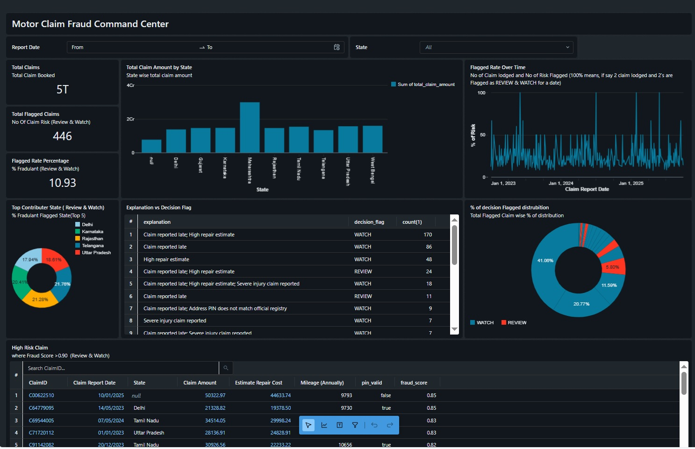

<div align="left">


</div>

# 🚗 Insurance Fraud Detection on Databricks

End-to-end **Motor Insurance Fraud Detection** pipeline built on the **Databricks Lakehouse** using **Delta Lake**, **scikit-learn**, and a **Fraud Command Center Dashboard** for claim investigators.

The workflow detects suspicious claims, explains *why* they look risky, and provides an **AI Q&A assistant** to support investigation decisions.

---


## 🎯 Problem Overview

Insurance companies process thousands of motor accident claims every month.  
Most of these claims are genuine — repairs, accidents, weather damage, etc.  
But a small percentage are **fraudulent**, such as:

| Example Fraud Scenario | What Happens |
|---|---|
| Repair shop inflates the repair cost | Claim amount is higher than damage |
| Customer delays reporting the accident | More time to “prepare” a story |
| Claimant uses a fake or mismatched address | Harder to verify authenticity |
| Injury severity is exaggerated | Higher compensation requested |

Even **1–2%** fraud can lead to **millions in financial losses** every year.

### Why Manual Review Fails
- Claims officers receive **too many claims** to review them all in depth.
- There is no easy way to **prioritize** which claims look suspicious.
- Rules vary by **region, vehicle type, and circumstances**, making it complex.

As a result:
- **High-risk claims may get approved**
- **Low-risk claims may get delayed unnecessarily**
- Time and money are wasted

---

## ✅ What This Solution Does

This project helps claim teams be **faster and more accurate** by:

| Feature | Benefit |
|---|---|
| **Scores each claim for fraud likelihood** | High-risk claims move to the **front** of the review queue |
| **Explains *why* a claim looks suspicious** | Investigators understand the **context**, not just a score |
| **Shows patterns in states, repair values, and reporting delays** | Helps identify **fraud clusters** or repeat patterns |
| **Allows natural language Q&A** | Analysts can ask: “Show me risky claims in Delhi last month” |

---

## 🧍 Example Scenario (Simple and Realistic)

Suppose we see the following:

| Claim ID | State | Claim Amount | Repair Estimate | Report Delay | PIN Match | Result |
|---|---|---|---|---|---|---|
| C239441 | Delhi | ₹38,500 | ₹36,200 | 14 days late | ❌ Mismatch | **Suspicious** |
| C102887 | Maharashtra | ₹9,200 | ₹8,850 | Same day | ✅ Valid | Normal |
| C552991 | West Bengal | ₹72,000 | ₹71,400 | 17 days late | ✅ Valid | **Suspicious** |

Patterns we notice:

- Claims reported **late** often show **inflated repair amounts**
- PIN mismatch may indicate **incorrect identity or address**
- Certain **states** show repetitive inflated claims

The system automatically surfaces the **first and third claim** as **Review First** cases.

---

## 🎯 Outcome

Instead of reviewing all claims equally:
- **High-risk claims get investigated first**
- **Low-risk claims are processed quickly**
- Fraud is detected **earlier**, saving time and cost

This creates a **smarter, fairer, and faster** claims workflow.


## 🧰 Tech Stack Used

| Layer | Tools / Technologies |
|------|----------------------|
| **Platform** | Databricks Community Edition (Free Tier) |
| **Storage & Tables** | Delta Lake, DBFS, Databricks SQL |
| **Data Processing** | PySpark, SQL, Notebooks |
| **ML Model** | scikit-learn (Gradient Boosting / IsolationForest fallback) |
| **Explainability** | Rule-Based Reason Signals (Custom) |
| **Visualization** | Databricks SQL Dashboard |
| **AI Assistant (Q&A)** | MLflow Deployments + `databricks-meta-llama-3-3-70b-instruct` |

---
## 🧱 Data Pipeline (Bronze → Silver → Gold → ML → Dashboard)

| Step | Notebook | Output |
|---|---|---|
| Raw Ingest | `01_bronze_ingest.py` | `bronze_claims` (Delta) |
| Postal PIN Enrichment | `01_bronze_pin.py` | Valid / mismatch region signals |
| Cleaning + Feature Creation | `02_silver_clean.py` & `02b_offline_enrichment_india.py` | `silver_enriched_claims` |
| Feature Assembly | `03_gold_assemble_tmp.py` → `03c_promote_gold` | `gold_claim_features` |
| Model Training + Scoring | `04_train_and_score.py` | `gold_scored_claims` |
| Explainability Rules | `05_add_rule_explanations.py` | `gold_scored_claims_explained` |
| Final Dashboard View | `General_Output_view.sql` | `vw_claims_enriched_scored` |

---

## 📊 Fraud Command Center Dashboard



The dashboard provides:

| Feature | Purpose |
|---|---|
| **Total & Flagged Claims** | Assess overall portfolio risk |
| **State & Decision Filters** | Regional fraud pattern discovery |
| **Fraud Score Distribution** | Evaluate model threshold alignment |
| **Claim Timeline Trends** | Detect sudden or coordinated spikes |
| **High-Risk Claim Table** | Immediate investigation entry point |

### Decision Thresholds
| Score Range | Action |
|---|---|
| `< 0.50` | PASS |
| `0.50 - 0.70` | WATCH |
| `≥ 0.70` | REVIEW |

---

## 🧾 Explainability Layer

Each scored claim receives a **human-interpretable explanation**, e.g.:

- *Claim reported late*
- *High repair estimate relative to mileage*
- *PIN mismatch with official registry*
- *Severe injury reported*
- *No police report filed*

Stored in: **`gold_scored_claims_explained`**

---

## 🤖 AI Q&A Assistant (Free Edition, No Vector DB)

```python
from mlflow.deployments import get_deploy_client
client = get_deploy_client("databricks")

resp = client.predict(
  endpoint="databricks-meta-llama-3-3-70b-instruct",
  inputs={"messages":[
      {"role":"system","content":"You are helpful and concise."},
      {"role":"user","content": prompt}
  ]}
)

print(resp["choices"][0]["message"]["content"])
```

**Example Response**
```
There are 11 claims. Several show late reporting and unusually high repair costs.
Most occur in Delhi, Telangana, and West Bengal.
```

---

## 📂 Repository Structure

```text
insurance-fraud-databricks-hackathon/
├── notebooks/
├── dashboard/
└── README.md
```

---

## 🚀 How to Run

1. Run notebooks **01 → 05**
2. Build dashboard in Databricks SQL
3. Use AI Q&A notebook for investigation summaries

---

## 🏁 Result

This solution demonstrates **practical, explainable fraud detection** with real investigation value.
