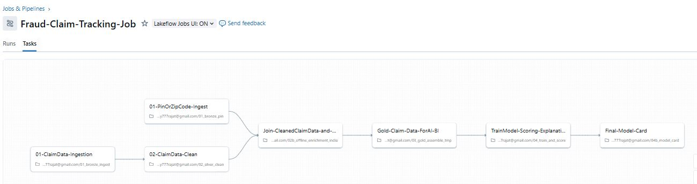

# 🚗 Insurance Fraud Detection on Databricks

This project implements an **end-to-end Insurance Fraud Detection pipeline** on the **Databricks Lakehouse**, using **open-source ML**, **Delta Lake**, and a **Fraud Operations Dashboard** designed for claim adjusters.

The solution ingests raw motor insurance claim data, cleans and enriches it, builds ML-driven fraud risk scores, produces human-readable investigation notes, and supports analysts with an interactive dashboard and AI-assisted insights.

---

## 🎯 Problem Statement

Insurance companies face thousands of motor insurance claims each day.  
Only a small portion are fraudulent, but detecting them is critical to avoid financial loss.

Traditional manual review is:
- Slow  
- Inconsistent  
- Costly  

Our solution:
- Uses **data + ML + explainability**
- Flags claims that should be **reviewed first**
- Helps investigators **understand why** a claim looks suspicious
  
## ✅ High-Level Architecture
```markdown


            +-------------+
            | Raw Claim   |
            |   Data      |
            +------+------+
                   |
                   v
        (01) Bronze Layer - Raw Ingestion
                   |
                   v
       (02) Silver Layer - Data Cleaning & Standardization
                   |
                   v
       (03) Offline Postal PIN Enrichment (IndiaGov API / cached)
                   |
                   v
       (04) Gold Layer - Feature Engineered ML Table
                   |
                   v
       (05) ML Model (Gradient Boosting + fallback IsolationForest)
                   |
                   v
       (06) Human-friendly Explanations & Decision Flagging
                   |
                   v
       (07) Databricks SQL Fraud Command Center Dashboard (Global Filters)

```
## 🧱 Pipeline Components

<p align="center">
  
</p>


| Step | Notebook | Description |
|---|---|---|
| **Bronze Ingest** | `01_bronze_ingest.py` | Load CSVs or staging tables to Delta (`bronze_claims`) |
| **PIN Validation** | `01_bronze_pin.py` | Offline enrichment to identify invalid address ZIP/PIN codes |
| **Silver Clean** | `02_silver_clean.py` | Normalize schema, clean values, derive claim delay |
| **PIN Merge + Feature Prep** | `02b_offline_enrichment_india.py` | Attach region / district metadata |
| **Gold Assembly** | `03_gold_assemble_tmp.py` → `03c_promote_gold` | Produce `gold_claim_features` ready for ML |
| **ML Model Training & Scoring** | `04_train_and_score.py` | GradientBoosting (supervised) or IsolationForest (fallback) |
| **Model Evaluation Card** | `04b_model_card.py` | Records AUC + Precision@50/100 into `model_card_gbt` |
| **Explainability Layer** | `05_add_rule_explanations.py` | Creates `gold_scored_claims_explained` with reason strings |
| **Final View for Dashboard** | `General_Output_view.sql` | View used by dashboard with filters |

---

## 📊 Fraud Command Center Dashboard (Databricks SQL)
<p align="center">
  
</p>

This interactive dashboard provides a consolidated view of **Motor Insurance Claim Fraud Risk** across the dataset.  
It is backed by the `gold_scored_claims_explained` table, enriched with rule-based signals and ML-driven fraud probability scores.

### Key Capabilities

| Component | What it Shows | Why It Matters |
|---------|---------------|----------------|
| **Total Claims & Flagged Claims Overview** | Count of all processed claims and how many were flagged for review | Quickly assess the overall fraud pressure on the portfolio |
| **Average Fraud Score** | Mean fraud score across filtered claims | Indicates the general risk trend of current data slice |
| **State & Decision Filters** | Dashboard updates dynamically when selecting a State or Decision Flag | Enables targeted investigation and region-specific insights |
| **Trends Over Time (Report Date Filter)** | Visualizes patterns of claim frequency and risk score over time | Detects abnormal spikes indicating possible coordinated activity |
| **Fraud Score Distribution** | Histogram showing how many claims fall into PASS / WATCH / REVIEW | Helps gauge model sensitivity and threshold sanity |
| **High-Risk Claims Table** | Sorted view showing top suspicious claims with explanations | Direct entry point for analyst deep-dive and investigative follow-up |

### 🧠 How to Use It as an Analyst
1. **Filter by State** to identify unusual hotspots (e.g., clusters in a region).
2. **Drill into High-Risk Claims** table to view reason flags like:  
   - *Claim reported late*  
   - *High repair estimate*  
   - *Address PIN mismatch*  
   - *Severe injury claim reported*
3. **Validate supporting documents**, perform follow-up checks, or recommend manual review.

### 🎯 Outcome
This dashboard enables **data-driven fraud prioritization**, ensuring analysts focus effort where it has the highest impact — improving fraud catch rate while reducing unnecessary manual reviews.

### 🧠 Primary Model: **Gradient Boosting Classifier**
Used when we have **both** fraud (1) and non-fraud (0) labels.

### 🧠 Fallback Model: **Isolation Forest**
Used when labels are missing or all claims are one class (common in real data).

### 🎚 Output Scoring Logic
fraud_score < 0.50 → PASS
0.50 ≤ fraud_score < 0.70 → WATCH
fraud_score ≥ 0.70 → REVIEW


---

## 🔍 Explainability

We generate **human-readable reason statements**:

- "Claim reported late"
- "High repair estimate"
- "Low mileage but high claim value"
- "PIN code does not match official registry"
- "Severe injury reported"
- "No police report filed"

These are combined into one `explanation` text field to support **investigator decision making**.


## 🤝 AI Assistant (Optional RAG-lite Notebook)

A lightweight context-based Q&A assistant summarizes patterns and suggests actions **without requiring Vector DB / Mosaic AI**, so it works in **Free Edition**.

Example prompt:
"Summarize why claims in Delhi were flagged last month"


---

## 🗂 Repository Structure
nsurance-fraud-databricks-hackathon/
│
├─ notebooks/
│ ├─ 01_bronze_ingest.py
│ ├─ 02_silver_clean.py
│ ├─ 02b_offline_enrichment_india.py
│ ├─ 03_gold_assemble_tmp.py
│ ├─ 04_train_and_score.py
│ ├─ 04b_model_card.py
│ ├─ 05_add_rule_explanations.py
│ └─ General_Output_view.sql
│
├─ dashboard/
│ └─ screenshots/
│
└─ README.md


---

## 🚀 How to Run This

1. Upload CSV claim dataset to Databricks.
2. Run notebooks in order:  
   `01 → 02 → 03 → 04 → 04b → 05`
3. Open Databricks SQL → Create dashboard → Add global filters → Add panels.
4. Investigate high-risk claims & supporting explanations.

---

## 🏁 Final Notes

This solution demonstrates:
- Real-world feature engineering
- Handling missing or unreliable labels
- Practical fraud scoring thresholds
- Explainability for claim handlers
- A dashboard that supports *action*, not just scoring

Suitable for:
- Hackathons
- POCs for Insurance Fraud Teams
- Claims Analytics Roadmap Foundations

---

## 📄 License
MIT License


